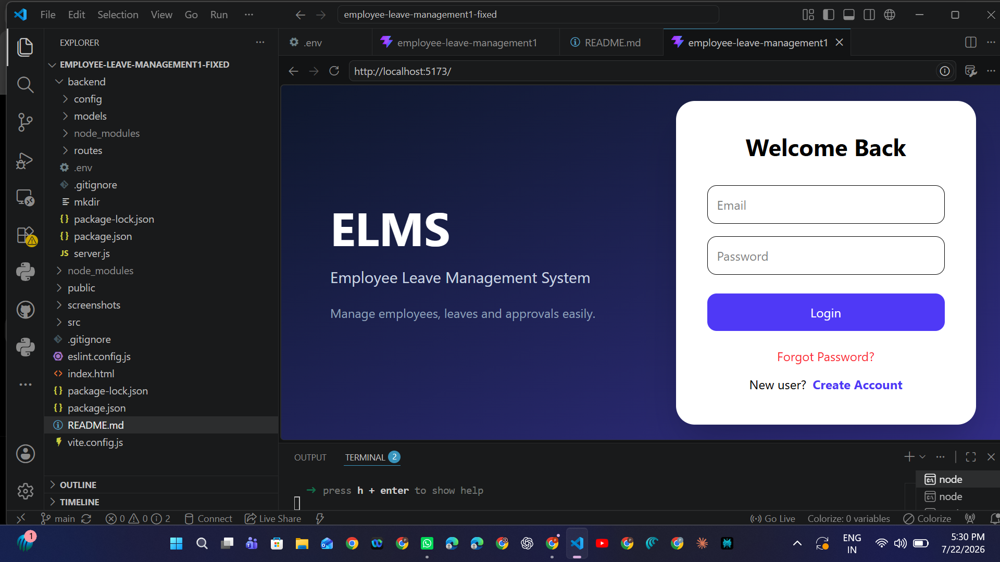
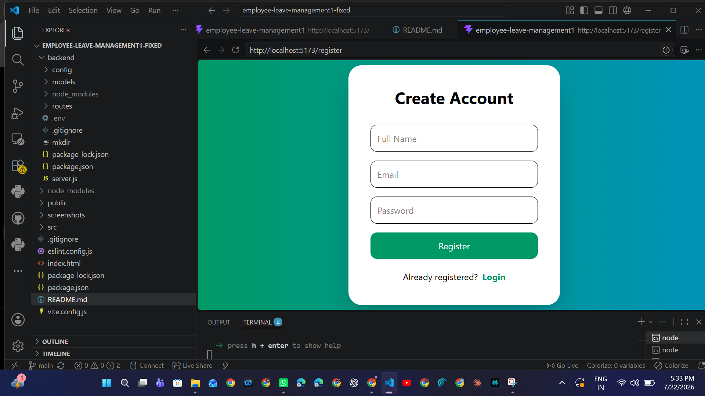
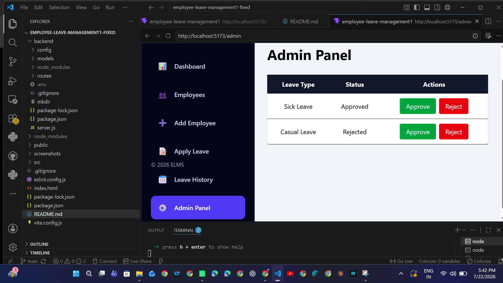
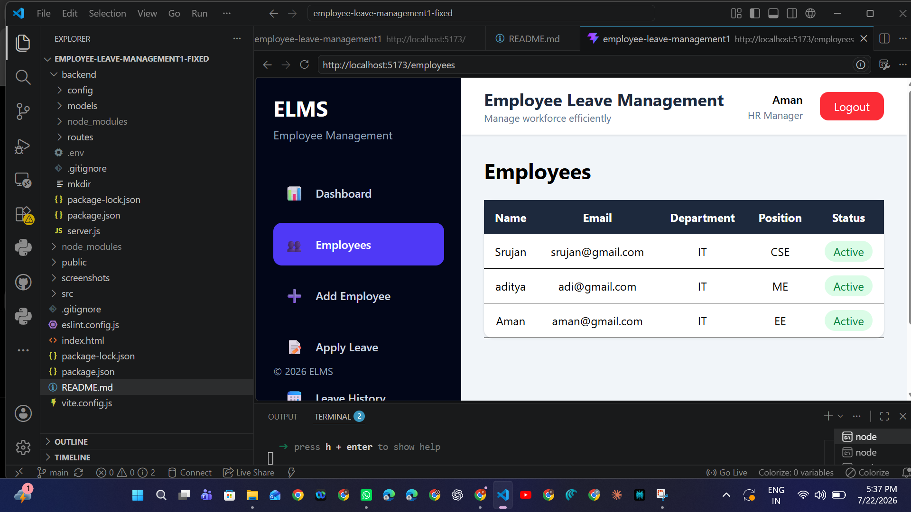
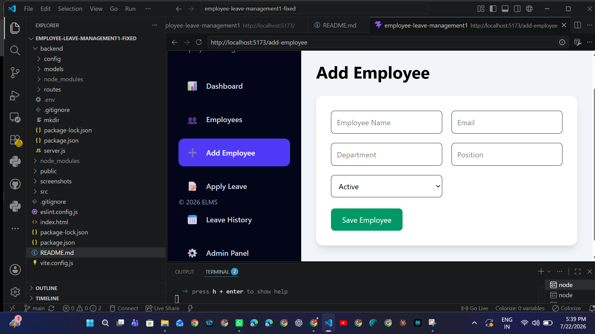
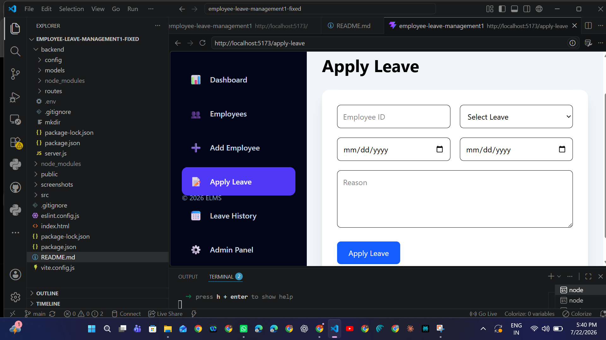
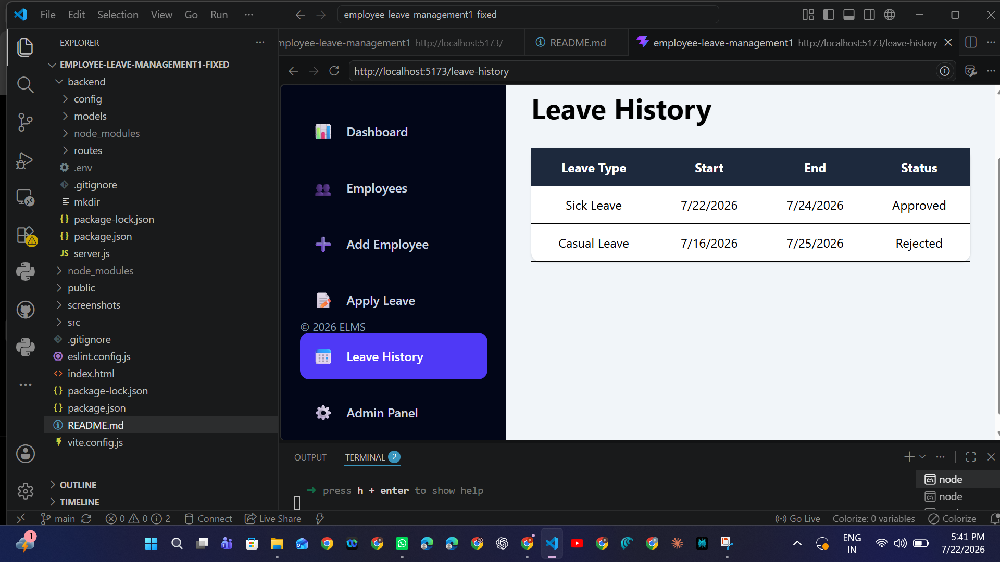

# Employee Leave Management System

A full-stack web application for managing employee records and leave requests. The system provides separate dashboards for administrators and employees.

---

## Features

### Authentication
- User Registration
- User Login
- Forgot Password
- Reset Password

### Admin
- Admin Dashboard
- Add Employee
- Edit Employee
- Delete Employee
- View Employee Profile
- Approve/Reject Leave Requests

### Employee
- Employee Dashboard
- Apply for Leave
- View Leave History

---

## Tech Stack

### Frontend
- React
- Vite
- React Router
- Axios
- CSS

### Backend
- Node.js
- Express.js
- MongoDB
- Mongoose
- JWT Authentication
- bcrypt

---

## Project Structure

```text
employee-leave-management-system/
│
├── backend/
├── public/
├── screenshots/
├── src/
├── README.md
├── package.json
├── vite.config.js
└── index.html
```

---

## Installation

### Clone Repository

```bash
git clone https://github.com/pranjal150-code/employee-leave-management-system.git
```

### Frontend

```bash
npm install
npm run dev
```

### Backend

```bash
cd backend
npm install
npm run dev
```

---

## Environment Variables

Create a `.env` file inside the **backend** folder.

```env
PORT=5000
MONGO_URL=your_mongodb_connection_string
JWT_SECRET=your_secret_key
```

---

## Screenshots

### Login Page



---

### Register Page



---

### Admin Dashboard



---

### Employee Dashboard



---

### Add Employee



---

### Apply Leave



---

### Leave History



---

## Future Improvements

- Email Verification
- Route Protection using JWT
- Profile Picture Upload
- Leave Statistics Dashboard
- Email Notifications
- Deploy using Vercel & Render

---

## Author

**Pranjal Prakash**

GitHub:
https://github.com/pranjal150-code

---

## License

This project is developed for educational purposes.